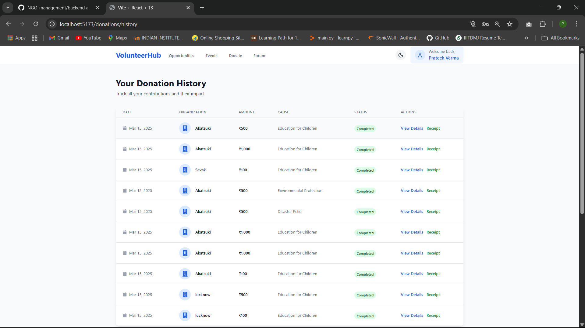
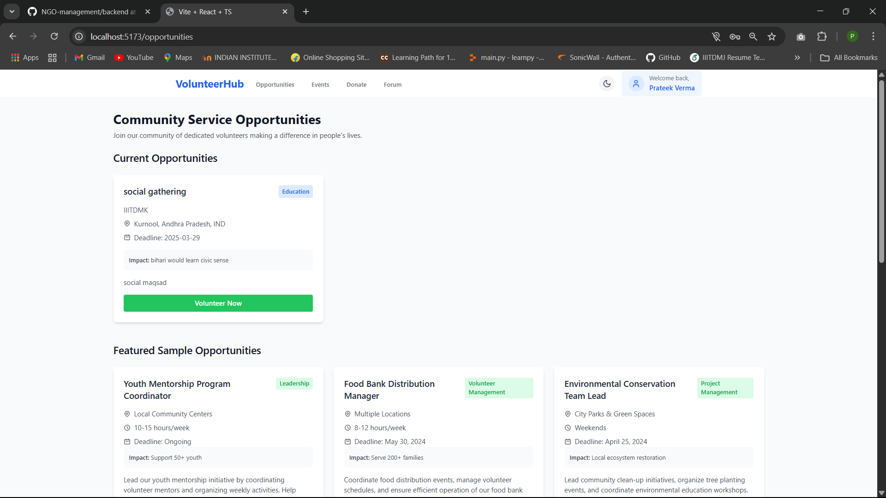
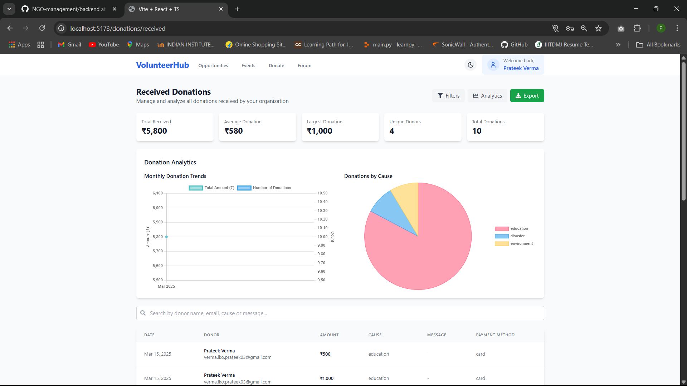
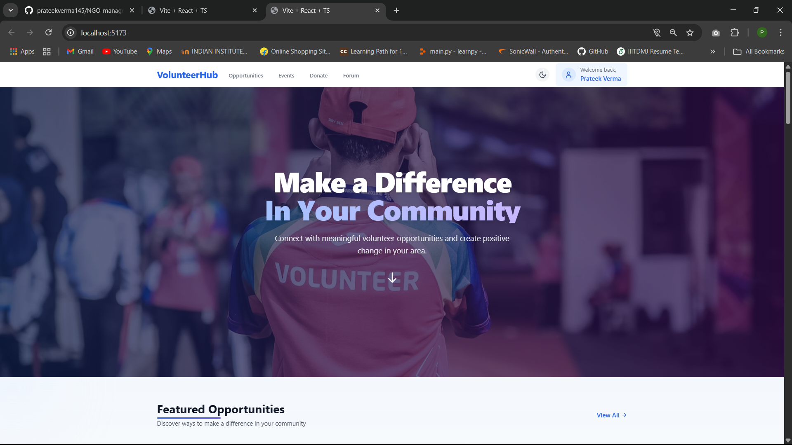
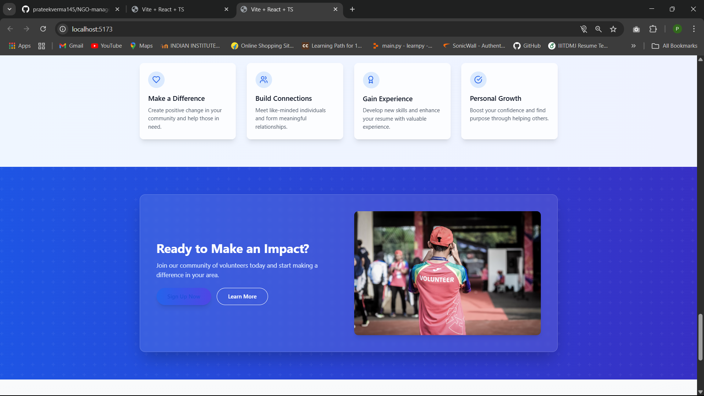
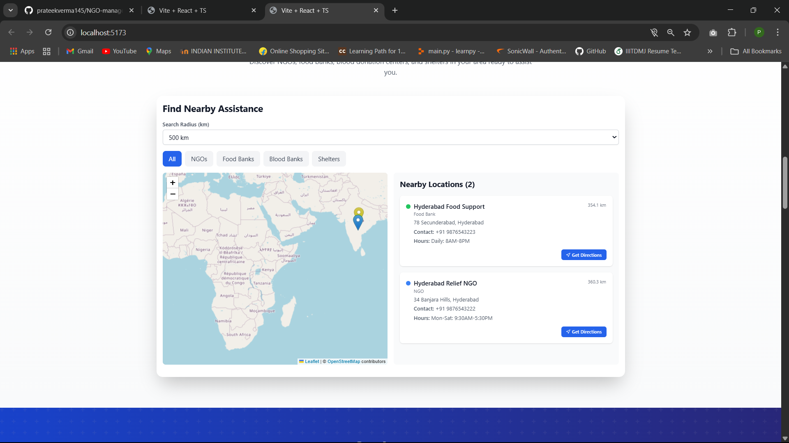
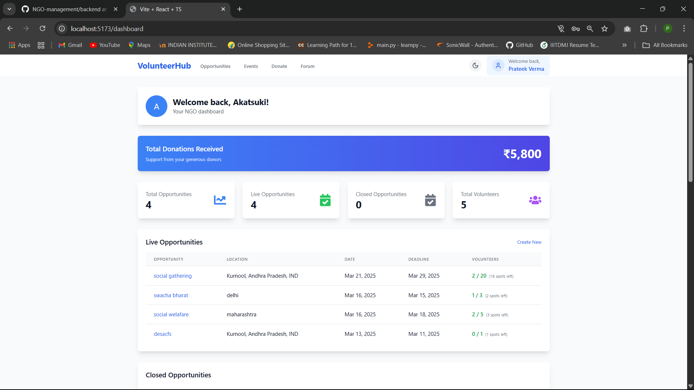
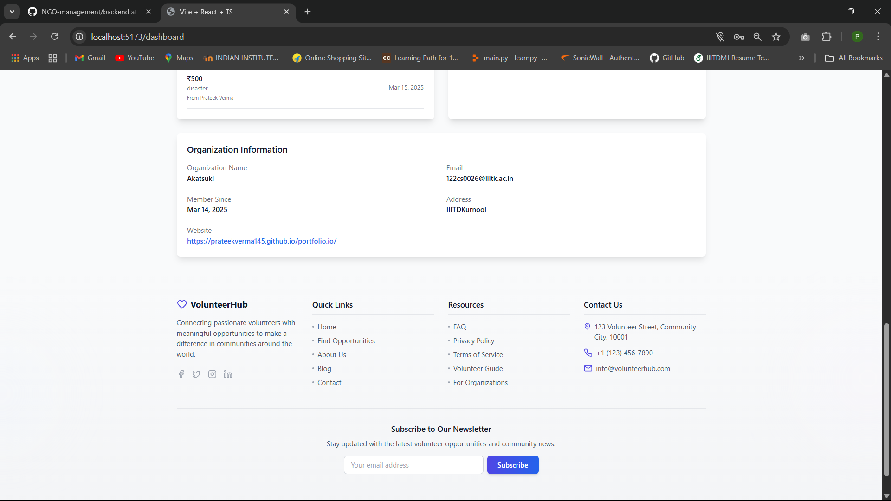

# Community Service & Volunteer Management Web/App

## 🌍 **Introduction**  
Our team participated in the Hackathon organized by **GDSC Club** during our college fest **Solasta**. The objective was to create an innovative solution addressing real-world problems. We chose to build a **Community Service & Volunteer Management Web/App**, connecting individuals with NGOs and community services for donations and volunteering opportunities.

---

## 🏷️ **Problem Statement**  
Many individuals and organizations struggle to find relevant volunteering or donation opportunities and connect with NGOs or local initiatives. This lack of coordination leads to underutilization of resources and missed opportunities to help those in need.

The challenge was to develop a web or mobile application that provides:
- **Volunteer & Donation Opportunities**: A platform for NGOs and communities to post tasks and donation needs.
- **Location-Based Assistance Finder**: Helps users find nearby NGOs, food banks, blood donation centers, and shelters.
- **Event Coordination & Alerts**: Notifies users about upcoming charity events, cleanliness drives, and disaster relief efforts.
- **Skill-Based Volunteering**: Matches volunteers based on skills (e.g., teaching, healthcare, etc.).

---

## 💡 **Our Solution**  
We developed a web-based platform where:
- NGOs and organizations can list volunteering opportunities and donation drives.
- Users can browse or search for nearby opportunities using location-based services.
- Real-time alerts inform users of upcoming community events.
- Skill-based matchmaking connects volunteers with relevant opportunities.

---

## 🛠️ **Technologies Used**  
The stack includes:
- **Frontend:** React.js (for a dynamic and responsive user interface)
- **Backend:** Node.js with Express.js (for handling server-side operations)
- **Database:** MongoDB (for storing user, NGO, and event data)
- **API Integration:** Google Maps API (for location services)
- **Authentication:** Firebase (for secure user login and registration)
- **Deployment:** Vercel (for hosting the web application)

---

## 🏗️ **System Architecture**
The system is built on a modular architecture with the following components:
1. **User Module:** Handles user registration, login, and profile management.
2. **NGO Module:** Allows NGOs to post donation and volunteering needs.
3. **Location Services:** Implements Google Maps API for nearby searches.
4. **Event Management:** Lists and notifies users about upcoming events.
5. **Database Layer:** Ensures secure data storage and retrieval.

---

## 🔑 **Key Features**
- **Location-Based Search:** Find NGOs, food banks, and shelters nearby.
- **Volunteer Opportunity Listings:** Discover volunteering events and donation drives.
- **Real-Time Notifications:** Get instant alerts for new events or opportunities.
- **Skill-Based Volunteering:** Personalized matches based on user skills.
- **Secure Authentication:** Firebase-secured user accounts.

---

## Screenshots

## Screenshots

## 🚧 **Challenges Faced**
- **Integration of Location Services:** Overcoming issues with Google Maps API rate limits.
- **Real-Time Notifications:** Implementing efficient push notifications.
- **Database Optimization:** Ensuring fast retrieval and scalability for increasing user data.

---

## 🚀 **Future Scope**
- **Mobile App Development:** Extend the web app to mobile platforms.
- **Advanced Matching Algorithms:** Better skill-to-opportunity matchmaking.
- **Gamification:** Introduce badges and rewards for active volunteers.
- **Community Feedback:** Enable reviews and feedback for NGOs.

---

## 🤝 **Contributions**
Our team members contributed in the following ways:
- **Frontend Development:** UI design and user interaction.
- **Backend Development:** API creation and database integration.
- **Research & Innovation:** Implementing skill-based matchmaking.
- **Testing & Deployment:** Ensuring seamless performance.

---

## 🎉 **Conclusion**
This hackathon project was a remarkable learning experience where we tackled real-world challenges using technology. By building a platform that bridges the gap between volunteers and NGOs, we aim to create a positive social impact. This is just the beginning; with future improvements, our platform can grow into a comprehensive community service hub.

